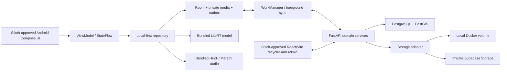

# Technical specification

Authority: [PRD](01_PRD.md) and [decisions](09_DECISIONS.md). Related: [schema](06_SCHEMA.md), [API](16_API_CONTRACT.md), and [sync](17_OFFLINE_SYNC.md). Scope IDs are in the [register](15_REQUIREMENTS.md).

## Architecture and code boundaries



Android reads UI state from Room, including the most recent server results. Network calls update repositories, never bypass them. Domain services own price, matching, offers, handover, payment, quality and role/ownership rules. The web client calls FastAPI; it does not write directly to Supabase tables. PostgreSQL is authoritative for shared confirmation and accepted server operations; Room is authoritative for durable local work pending synchronization. This is one modular API, not microservices or full event sourcing: normalized current-state rows plus immutable domain/audit events.

Planned implementation layout (paths are targets, not existing software):

```text
apps/android/        Gradle wrapper, app, data/local, data/network,
                     repositories, domain, ui/features, resources/assets
apps/web/            Vite app, role routes, features, shared components,
                     API client, translations, tests
services/api/        routers, schemas, models, services, repositories,
                     security, storage, migrations, tests
ml/                  manifests, training, evaluation, exports, model card
data/                raw, staging, processed, seed, synthetic, manifests
infra/               Dockerfiles, Compose, deployment configuration
scripts/             imports, validators, seeds, export and docs checks
design/stitch/       approved screen registry and retrieved references
docs/                canonical specifications, planning, evidence
```

Use Kotlin/Compose/Material 3/MVVM/Hilt/Flow/Navigation, Room, WorkManager, CameraX, Fused Location, LiteRT, Android resources, ZXing and PdfDocument. Use React/Vite/TypeScript/Tailwind/shadcn/Router/TanStack Query/RHF/Zod/Recharts/MapLibre. Zustand is unnecessary until a demonstrated cross-screen local-state need; do not add multiple competing state systems. Python uses FastAPI/Pydantic v2/SQLAlchemy 2/Alembic/psycopg, PyJWT/Argon2id and ReportLab, with pandas/pdfplumber for data tooling. The Python and Kotlin implementations of offline-capable business calculations share fixture files and policy versions, not hand-maintained divergent behavior.

## Toolchain and feasibility gate

T001 records exact Android Studio, SDK/min/target SDK, JDK, Gradle wrapper, Android Gradle Plugin, Kotlin/Compose, Room/Hilt/LiteRT versions, Python, Node, package manager and lockfiles. Start with a compatible supported combination from official documentation; do not pin guessed versions in prose. Proposed baseline min SDK is API 26, subject to LiteRT/camera compatibility and the available phone; record a deliberate change rather than silently abandoning entry-level support. API level support and low-end performance are different checks.

T003 proves a photo → compressed app-private file → Room record → restart → offline LiteRT inference journey on the owner's real phone. Its only UI is owner-generated Stitch S00. Nonvisual scaffold/unit tests can proceed before that design is supplied. The earlier suggested one-day spike is a maximum risk checkpoint, not permission to spend half the deadline on Gradle or to auto-switch to PWA. Owner has chosen native Android despite risk. If blocked, record exact build/device error, attempted fixes and alternatives in [open questions](10_OPEN_QUESTIONS.md).

## Price policy `PRICE_V1`

These numerical choices are **documented engineering defaults**, not prior user decisions, official rates or empirically validated statistical guarantees. Store them in one versioned policy configuration returned by bootstrap. Test them; change through a decision record and shared fixtures.

1. Accept nonnegative integer `rate_paise_per_unit`, dated source, material/subcategory, price kind, condition/grade, geography, unit and review status. A zero quote may mean disposal/no purchase: label it explicitly, never treat it as a missing-value replacement.
2. Normalize grams/kg only through known conversions. Piece/unit quotes remain separate until an actual measured unit weight exists. Never compare whole-appliance per-piece prices with PCB per-kg prices. Keep BUY/QUOTE/SELL and material/condition cohorts separate. Show recycler offers separately from the reference buying-rate cohort.
3. Eligible reference observations: approved, non-demo, non-synthetic, same cohort, observed within 30 days. Start with exact pilot region; if insufficient, explicitly widen to configured adjacent/state scope and label the broader coverage. Never mix Delhi and Maharashtra without displaying the change of scope.
4. Reject future-dated observations beyond a five-minute clock tolerance for live ingestion; historical imports use their known source dates. `retrieved_at` is not `observed_at`. Missing observation date is unqualified history, not today's price.
5. Deduplicate by original source observation/transaction. Repeated scraping or mirrored sources do not count as independent observations. For summary weighting, cap each original source to one representative observation per cohort/day; retain raw history separately.
6. Weight observation `i`: `w_i = 2^(-age_days/7)`. Baseline source weights are equal among eligible reviewed observations; source diversity affects confidence. This avoids an invented claim that government facility data makes a commercial price authoritative. Any later non-unit quality/location weights need a documented policy update.
7. Weighted quantile: sort by rate ascending, stable by observation ID; normalize positive weights; select the first rate whose cumulative weight is at least `q * total_weight`. Use q=.25/.50/.75. Range is Q1–Q3, midpoint is weighted median; expose all three plus sample count and date coverage. Document that a small-sample IQR is not a guaranteed market range.
8. Confidence: `INSUFFICIENT` for zero eligible observations; `LOW` for 1–2, a single independent source, or only a broader/stale cohort; `MEDIUM` for ≥3 observations from ≥2 independent sources with latest age ≤7 days; `HIGH` for ≥10, ≥3 sources, exact region and latest age ≤3 days. Conditions are conjunctive; highest satisfied tier wins. A stale cached summary (>24 hours since server calculation) is visibly stale and at most LOW. Historical values remain browsable.
9. Valuation: `total_paise = round_half_up(rate_paise_per_kg * weight_g / 1000)` for low/median/high. Do not multiply undocumented grade factors. Use matching condition cohorts; otherwise indicate unadjusted/uncertain estimate. Save policy/source IDs/cohort/weights/count/age/currency with lot estimate snapshot.
10. Trends: daily median of eligible observations for a selected period, with source counts; missing days are gaps. Comparisons use matching units and price kind. Do not interpolate a fake rising market or show “live” for cached data.

Shared test fixture: equal weights for rates `[10000,20000,30000,40000]` paise/kg yield Q1=10000, median=20000, Q3=30000 using the specified first-cumulative method. A 2500g lot has low/median/high `[25000,50000,75000]` paise. UI may use familiar rupees, but arithmetic and wire values remain exact integers. Test time-fixed recency fixtures, single source, no-data, unsupported units, wider geography and quantile boundaries.

## Matching policy `MATCH_V1`

Hard eligibility requires: correct regulatory route and facility role, evidence of accepted material, current applicable registration/status and source verification, collector area supported, known minimum/maximum accepted weight compatible, operationally accepting if known. A stale/revoked authorization cannot be compensated by high price. If service area or material acceptance is unknown, exclude from recommended matches and allow separately labelled directory contact/clarification; never claim eligible.

Current verification defaults: successful source review within 30 days **and** underlying authorization within its actual validity period/status. The 30-day interval is a refresh policy, not an extension of legal validity. Historical list membership alone is insufficient to establish current authorization. Missing location still permits directory visibility but not “nearby” ranking.

For eligible candidates with a known location:

- Distance 30%: straight-line distance from PostGIS `geography(Point,4326)` in metres; `max(0, 1 - distance/search_radius)`, default radius 50km. Explicitly distinguish straight-line from driving distance/time.
- Comparable valid offered rate 30%: min-max normalize current comparable candidate rates; all equal → 1, no rate → 0 plus missing-rate explanation. Do not insert zero rupees as a quote.
- Pickup 20%: 1 if available for this lot/location, else 0; missing is labelled unknown.
- Availability 15%: 1 for current confirmed operational acceptance, 0.5 unknown, 0 unavailable (unavailable already filtered). Service-area eligibility stays a hard filter; no redundant score for merely passing it.
- Reliability 5%: completed/accepted eligible historical transactions, with denominator and minimum 5 observations; unknown → 0.5 explicitly labelled no history. Use non-demo history for real candidates. This is operational behavior, not regulatory status.

Score is 100 times weighted sum; stable tie-break is shorter distance then stable facility ID. Show “Recommended match,” factor explanation, missing data and policy version. User can select a different eligible candidate. Cache the candidate evidence and policy; offline recommendation is provisional and revalidated on server. Local Haversine is only a cached distance fallback, with tolerance tests against PostGIS, not a replacement for server PostGIS. No GPS: allow coarse/manual region and indicate approximate distance or omit it.

No matches: keep lot, show reasons, permit a wider search where compatible, or request facility clarification. Never relax the legal route or invent a recycler. If displaying an aggregator/collection centre, label the intermediary and distinguish transfer evidence from a final formal destination.

## Review rules `QUALITY_V1`

Use immutable flags with reason, inputs, policy, severity, subject version and resolution actor/reason/time. Rules describe evidence needing review; they do not decide criminal intent or auto-delete data.

| Rule | Baseline behavior |
|---|---|
| Missing/invalid | Block structurally impossible submission (negative/NaN/overflow weight or money, broken references); permit incomplete draft |
| Price outlier | With ≥5 comparable observations and IQR>0, outside Q1−1.5×IQR or Q3+1.5×IQR → review; with IQR=0 use below .70×median or above 1.30×median when median>0; otherwise insufficient evidence |
| Weight difference | `abs(received_g-estimated_g)/estimated_g > .20` → review; original estimate must be positive |
| Duplicate media | Same image SHA-256 used across active distinct lots → review, not proof of duplication/fraud |
| Repeated sale | Conflicting active accepted transaction for the same lot → reject second acceptance; preserve attempted operation result |
| Stale evidence | Expired/freshness-failed verification → exclude new matches; flag existing pending handovers for revalidation |
| Incomplete handover | Missing required evidence/location quality/party confirmation → show incomplete/pending, never confirmed complete |

The conflicting 15–20%, 30–35% weight thresholds and 2σ/MAD variants in the source are replaced by this one baseline. Admin review can acknowledge a legitimate variance but cannot erase the measurements or bypass route authorization.

## Performance and failure budgets

Targets are engineering goals to measure, not guaranteed achievements: cached first screen ≤2s; local structured save ≤1s after image processing; typical photo compression ≤2s; warm simple API p95 ≤500ms excluding free-host cold start. Aim for ≤150KB upload per photo without making evidence unreadable; hard upload bound default 2MB, pixel bound 20MP, max 5 images per lot. Record actual APK/model/audio download sizes; proposed release APK budget ≤40MB and LiteRT model ≤5MB are tunable goals with a recorded decision if exceeded. Model latency goal ≤500ms on the tested phone; keep inference/compression off UI thread and show cancellable progress. Record peak memory, no OOM/ANR and behavior under storage pressure.

Map failure returns to list. Model failure returns to manual category. Audio missing shows text/icon and a recoverable asset error; missing required language/audio still fails release acceptance. API outage preserves outbox. A reference-data failure does not clear the old cache. Disk-full means “not saved,” never false success. No cloud API can be a prerequisite for offline core actions.

## Technical reference checks

Android documents local/network repositories, Room-backed queues and WorkManager for offline data access; this project additionally defines its own financial conflict rules. [Android offline-first guidance](https://developer.android.com/topic/architecture/data-layer/offline-first).

LiteRT supports Android on-device inference; select and measure a compatible CPU path rather than assuming an NPU or a borrowed latency result. [Google LiteRT](https://developers.google.com/edge/litert/overview).

PostGIS is available as a PostgreSQL extension in Supabase; enable and verify it through migrations. [Supabase PostGIS](https://supabase.com/docs/guides/database/extensions/postgis).
