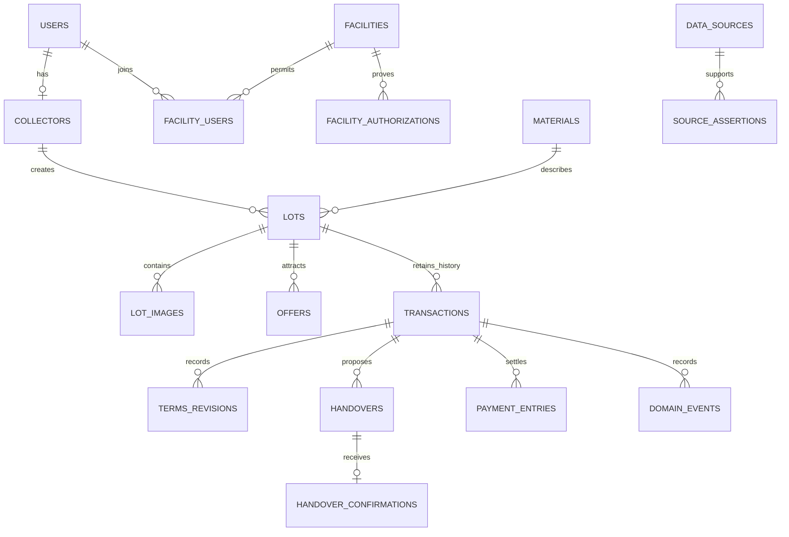

# Database, local storage, and data dictionary

Related: [flow](04_APPFLOW.md), [API](16_API_CONTRACT.md), [offline protocol](17_OFFLINE_SYNC.md), [dataset exports](18_DATA_PROVENANCE.md). This is the implementation contract for T006/T013, not a claim that migrations exist.

## Conventions

All entities use UUIDs; client-created objects retain their UUID on the server. UTC timestamps use ISO 8601 in APIs and `timestamptz` in Postgres; Android stores epoch milliseconds. Preserve `occurred_at_client`, `received_at_server`, timezone/clock-quality where relevant. Server time decides expiry/authorization; client time remains evidence, not an ordering authority.

Money is signed 64-bit **integer paise**, currency `INR`. Rates name their units (`rate_paise_per_kg`); whole totals never share a field named `price` with rates. Weight is signed 64-bit **integer grams**; database constraints require positive weight for submitted material. APIs reject overflow/NaN/unsupported precision; negative money is allowed only for a typed reversal/correction entry that references an original. PostgreSQL `bigint`, Kotlin `Long`, and TypeScript safe integer validation share a supported range of ±9,007,199,254,740,991; business values are much smaller.

Mutable entities have `version bigint`, `created_at`, `updated_at`; soft deletion uses `deleted_at` and synchronization tombstones. Immutable events are never updated. Common provenance envelope: `source_id`, `origin_class`, `source_kind`, `is_demo`, `data_version`, `captured_at`, `verified_at?`, `verified_by?`, `confidence?`, `lineage_ids[]`. `confidence` describes data quality where documented, not classifier output. Mixed-field records use source assertions below.

UUID references, unique keys and check constraints belong in the DB as well as API validators. Index every FK used for lookup, `(collector_id, updated_at)`, `(facility_id, updated_at)`, `(material_id,region_id,observed_at)`, event aggregate/sequence and outbox due state. Use PostGIS GiST on facility points/service areas. Do not replace Postgres with SQLite on the server; SQLite is Room's device database only.

## Entity dictionary

`?` means nullable for a stated reason; absence is never filled with invented source data. All fields below are required unless marked nullable or clearly a child relation.

| Table | Key fields and meaning | Constraints / lifecycle |
|---|---|---|
| users | id, phone_normalized, pin_hash, role, account_state, is_demo, created_at | Unique normalized phone per demo/real namespace; no public plaintext PIN; role assigned server-side |
| auth_sessions | id, user_id, device_id, refresh_token_hash, expires_at, revoked_at?, last_seen_at | Refresh token unique; rotation invalidates prior token; logout/revocation audited |
| collectors | id, user_id, display_alias?, preferred_language, region_id, general_area, consent_version | Unique user; language en/hi/mr; exact residence unnecessary |
| facility_users | user_id, facility_id, membership_role, active | Compound key; facility staff authority is scoped to one or more explicit facilities |
| regions | id, name, state_code, kind, parent_id?, centroid?, boundary? | Delhi-NCR and Maharashtra are independent configurable coverage scopes; coarse centroid is labelled |
| material_categories | id, code, label_key, display_order, active | Stable unique code; PS categories retained |
| materials | id, category_id, subcategory_code, description_key, condition_options, allowed_units, default_route, route_requires_context, safety_guide_ids, active | Reference catalog only; no per-lot photo/weight or hardcoded live price |
| material_aliases | id, material_id, language, local_term, normalized_term | Unique language+normalized term within taxonomy version; ambiguity yields choices |
| data_sources | id, publisher, title, url?, publication_date?, retrieved_at, source_kind, licence?, licence_url?, sha256?, local_snapshot?, locator?, review_status | URL may be absent for platform events; reason required. Source accessibility is not current regulatory verification |
| source_assertions | id, entity_type, entity_id, field_path, value_json, source_id, valid_from?, valid_until?, checked_at?, reviewer_id?, supersedes_id? | Append-only field-level claims: registration from registry, pickup from facility, coords from geocoder |
| facilities | id, name, facility_name, kind, address_public, district, state, region_id, geo_point?, geocode_accuracy?, contact_public?, active | Distinguish RECYCLER/REFURBISHER/DISMANTLER/AGGREGATOR/COLLECTION_CENTRE; public business contact only |
| facility_authorizations | id, facility_id, route, authority, reference, status, valid_from?, valid_until?, source_id, source_document_date?, verification_level, last_verified_at?, reviewer_id?, scope_notes | Multiple route-specific permissions possible. Missing validity requires explicit current-status evidence; not automatically valid forever |
| facility_materials | facility_id, material_id, route, accepted, min_weight_g?, max_weight_g?, evidence_source_id, updated_at | Accepted materials are evidenced; null min/max means unspecified, not fabricated zero/infinite verified capability |
| facility_operations | facility_id, pickup_status, service_regions, service_geometry?, accepting_status, operational_updated_at, source_id | TRUE/FALSE/UNKNOWN for pickup; rates in separate quotes. Service claims can be self-declared and visibly so |
| facility_rates | id, facility_id, material_id, condition?, region_id, rate_paise_per_unit, unit, price_kind, observed_at, valid_until?, source_id, review_status, is_demo | Rates do not imply an offer accepted by the collector |
| price_observations | id, material_id, subcategory_id?, region_id, condition?, rate_paise_per_unit, unit, price_kind, observed_at?, facility_id?, transaction_id?, source_id, review_status, rejection_reason?, provenance fields | BUY/QUOTE/SELL distinct; unique transaction-derived observation per transaction/price-kind; missing date disqualifies current price |
| price_summaries | id, cohort_key, policy_version, computed_at, source_cutoff_at, q1_rate?, median_rate?, q3_rate?, count, independent_sources, confidence, reason_codes, observation_ids, input_hash | Immutable snapshot; null rate with INSUFFICIENT; cache version retained on lot |
| lots | id, collector_id, material_id?, material_context?, regulatory_route?, estimated_weight_g?, condition?, description?, collection_location_id?, collected_at?, status, version, provenance fields | DRAFT can be incomplete; submitted positive weight; category unknown requires review; immutable agreed terms live elsewhere |
| lot_images | id, lot_id, media_id, purpose, order_index, captured_at?, source_id | PHOTO/RECEIPT_EVIDENCE; capture/import provenance; no blob inside JSON payload |
| media_objects | id, owner_user_id, owner_entity_id, storage_key, mime_type, byte_size, pixel_width, pixel_height, sha256, upload_state, created_at | STAGED/UPLOADED/VALIDATED/REJECTED; random server-controlled key; content decode + size bound |
| location_records | id, owner_entity_id, point?, coarse_area?, accuracy_m?, source, captured_at?, age_ms?, consent_version? | GPS/MANUAL/REGION/MISSING; exact point private; manual/coarse is not precise GPS |
| classifications | id, lot_id, model_id, model_sha256, predicted_class?, scores, threshold_version, abstained, user_selected_material_id?, confirmed_at?, actor_id | Original output immutable; subsequent correction is new event/record; no default confidence=100% |
| valuation_snapshots | id, lot_id, price_summary_id?, input_weight_g, condition, low_total_paise?, median_total_paise?, high_total_paise?, policy_version, currency, created_at | Null amounts for insufficient data, never zero placeholder |
| lot_requests | id, lot_id, facility_id, created_by, state, reason?, created_at | Directed visibility; listing scope documented; REJECTED/EXPIRED applies here, not erasure of lot |
| offers | id, request_id, lot_id, facility_id, rate_paise_per_kg?, fixed_total_paise?, price_basis, condition, weight_basis_g?, expires_at, status, terms_hash, version | Exactly one rate/fixed basis; immutable accepted version; changes create new revision |
| transactions | id, lot_id, collector_id, facility_id, accepted_offer_id, estimated_weight_g, agreed_weight_g?, quoted_total_paise, agreed_total_paise?, currency, lifecycle, version, is_demo | One active accepted transaction per lot; allow retained cancelled history; values include quote snapshot |
| terms_revisions | id, transaction_id, previous_revision_id?, final_material_id, measured_weight_g, final_total_paise, currency, proposed_by, proposed_at, collector_ack_at?, recycler_ack_at?, terms_hash, reason | Both parties agree same hash; final values become projection only after acknowledgements |
| handovers | id, transaction_id, lot_id, proposal_payload_json, proposal_hash, schema_version, proposed_by, proposed_at_client, received_at_server?, collection_location_id?, handover_location_id?, agreed_terms_revision_id?, status, public_token_hash?, version | Original proposal frozen; confirmation appended; public token random and revocable. Pending may reference unsynced client parent locally |
| handover_confirmations | id, handover_id, terms_revision_id, recycler_user_id, confirmed_at, event_id | Unique confirmed handover; same replay handled idempotently; alternative claim becomes review |
| payment_entries | id, transaction_id, amount_paise, method, private_reference?, asserted_by, asserted_by_user_id?, asserted_at, state, counterparty_ack_by?, ack_at?, reversal_of?, reason?, is_demo | CASH/UPI/OTHER; asserting actor identity is server-derived for counterparty/self-ack controls; ordinary positive entry; no double acknowledged reversal; no gateway execution |
| domain_events | id, aggregate_type, aggregate_id, sequence, event_type, actor_id, role, device_id?, occurred_at_client?, received_at_server, previous_state?, next_state?, payload_json, prev_hash, event_hash, schema_version, operation_id | Unique aggregate+sequence and operation-event identity; append-only server order |
| audit_logs | id, actor_id?, entity_type, entity_id?, action, request_id, timestamp, redacted_change, reason? | No PIN/token/photo blobs in audit; security attempts may have no authenticated actor |
| sync_operations | actor_id, device_id, operation_id, payload_hash, state, response_json, committed_at, entity_id | Unique actor+device+operation. Authorization checked on replay; result stored atomically with mutation |
| sync_changes | sequence, entity_type, entity_id, entity_version, visibility_scope, deleted_at?, created_at | Opaque authorized cursor projects changes; no client timestamp watermarks |
| safety_guides | id, material_ids, route, text_key, icon_asset_ref, image_asset_ref?, audio_keys, source_ids, version, review_status | Approved source-backed content; update through reference delta |
| quality_flags | id, entity_type, entity_id, entity_version, rule_id, policy_version, severity, evidence_json, status, assigned_to?, resolved_by?, resolved_at?, reason? | OPEN/ACKNOWLEDGED/RESOLVED; a flag resolution does not rewrite source facts |
| research_insights | id, evidence_type, source_ids, paraphrase, design_inference, requirement_ids, limitations | SECONDARY/SCENARIO now; no fabricated PRIMARY entry; private future consent stored separately |
| model_versions | id, model_sha256, labels_sha256, preprocess_version, licence_manifest_ref, metrics_ref, data_manifest_ref, threshold, supported_classes, created_at | Real evaluation values only; immutable release artifacts |
| training_images | id, path_or_object_key, source_id, licence_ref, sha256, object_group_id, material_label, labeler, label_confidence, split, condition?, weight_g?, region_id?, transaction_id? | Unique hash or documented permitted duplicate; nullable measurements reflect unavailable data |
| economics_scenarios | id, name, assumptions_json, source_ids, formula_version, is_illustrative, created_by, version | Always illustrative in initial prototype; never feeds actual ledger/impact totals |

## ER overview

The diagram is abbreviated; the dictionary defines the full set. An accepted transaction is not necessarily a paid transaction. Do not create duplicate ledger rows in addition to payment events and then sum both. Earnings are a query/materialized projection with a tested rebuild, not a mutable counter incremented on each retry.

## Dataset and evidence artifact versions

Versioned artifact metadata also needs `dataset_versions(id,family,schema_version,version,manifest_storage_key,manifest_sha256,counts_by_origin_demo,source_ids,generated_at,validation_status,data_card_ref)` with unique family/version. Model cards/evaluation artifact refs attach to model metadata; research cards attach to research insight rows. T029 serves these manifests to A07; T031 produces/wires exports and T047 freezes their release versions. Missing artifacts remain pending, not fabricated populated cards.

## Room model

Store local projections for collector/session metadata, materials/aliases/safety, facilities/authorization/operations/rates, price summaries/observations, lots/images, classification, valuations, offers/requests, transactions/terms, handovers/confirmations, payment entries, events, quality flags and model metadata. Local row keys match server UUIDs. Store `server_version`, `local_version`, `sync_state`, `last_pulled_at`, `dirty_fields`/pending proposal separately rather than overwriting local edits with pulled rows.

Local-only tables:

| Table | Fields |
|---|---|
| sync_outbox | operation_id, owner_user_id, device_id, entity_type, entity_id, command_type, payload_json, payload_sha256, base_server_version?, dependency_operation_ids, media_ids, created_at, attempt_count, next_attempt_at?, status, lease_until?, last_error_code?, last_error_message?, acknowledged_result? |
| sync_cursors | account_id, environment_id, dataset_scope, cursor, snapshot_version, last_success_at |
| local_media | media_id, relative_private_path, staged_path?, sha256, size, upload_state, server_key?, pending_reference_count |
| local_settings | language, numeral_mode, consent_version, audio_enabled, reference_policy_version, environment_id |

Keep PIN/refresh secrets out of ordinary Room tables; use Keystore-protected storage. Persistent local `device_id` is a random app identifier, not hardware fingerprint. Never reuse a user's cursor/outbox when switching accounts/environments. Do not automatically delete app data on logout if there are pending writes; explain consequences and allow sync/re-auth or explicit local export/removal choice.

## Hash fields and canonical serialization

Use canonicalization version `SAHITOL-JCS-1` implemented consistently and tested with fixed fixtures: UTF-8, lexicographic ASCII object keys, no insignificant whitespace, integer numeric representations, normalized UTC millisecond timestamps, fixed field inclusion with explicit null, arrays in documented order (media sorted by ID). Contract field names are ASCII; reject duplicate/unknown keys and floats, preserve true/false/null and UTF-8 string characters with JSON-required escaping only. Normalize strings to NFC before payload freeze, never differently after it. Coordinates in hashed evidence use integer microdegrees, accuracy integer metres; PostGIS may internally use numeric coordinates. The versioned restricted contract, not arbitrary serializer defaults, controls canonical bytes. Use the [computed pending fixture](planning/handover_fixture.json) and additional Unicode/escaping/fully evidenced event fixtures in T023 to verify all runtimes.

`proposal_hash = SHA256(canonical(proposal_payload))`. Payload includes schema_version, handover_id, transaction/lot/collector/facility IDs, agreed_terms_hash if available, material/weight/value snapshots, location reference/quality, occurred_at and media IDs+hashes. It excludes proposal_hash, signatures, sync status and mutable confirmation/payment projections. `event_hash = SHA256(canonical({schema_version, aggregate_id, sequence, prev_hash, event_type, actor_id, received_at_server, payload}))`. Genesis `prev_hash` is 64 zero hex digits. Client-local chain is a separate device sequence; server must not silently renumber it and call the original hash valid.

## Migrations and storage lifecycle

Alembic and Room migrations are versioned and tested with populated pending-outbox fixtures. No destructive Room fallback migration. Server migrations preserve accepted receipts and payment history; document reversible/backfill steps and take backup before destructive changes. Unique active-transaction and idempotency races need concurrent integration tests. Store schema versions with exported datasets.

Images are app-private staged → atomically renamed → referenced in Room. Recover orphan staged files after a bounded grace period; never remove files with unsynced references. Hosted storage is private and accessed via backend-authorized short-lived URLs. Deletion/retention schedules must preserve required pending evidence and follow [guardrails](12_GUARDRAILS.md), with explicit policy before real pilot use.
