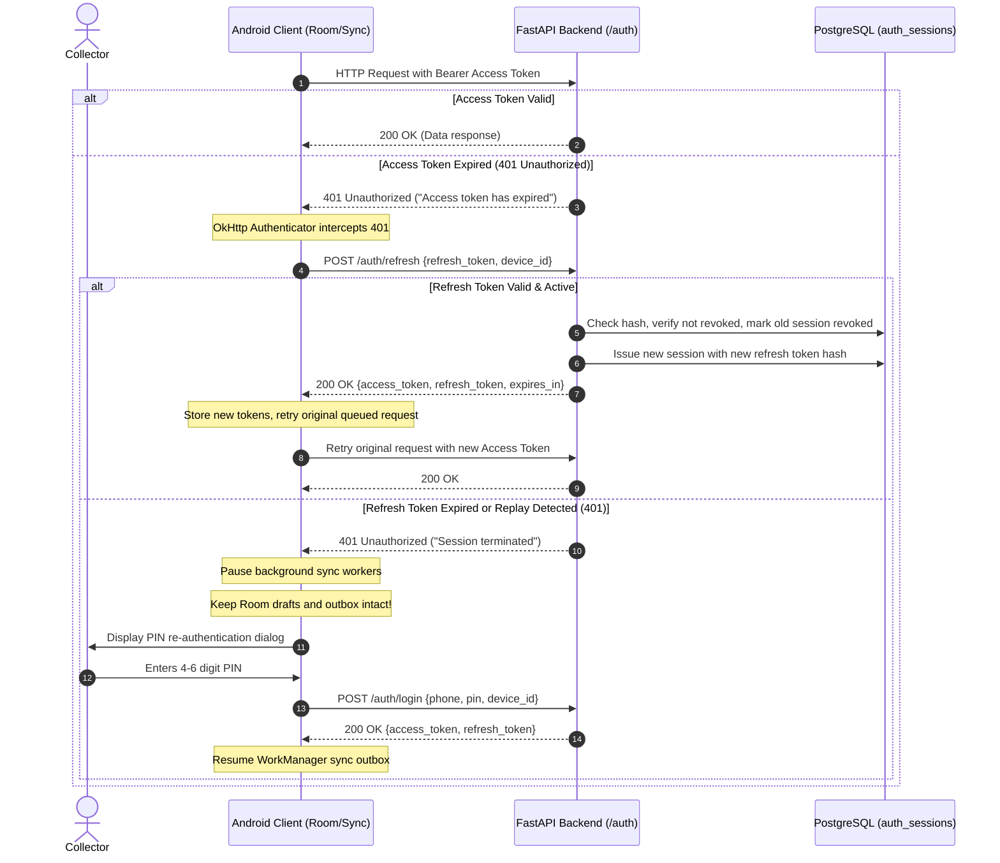

# SahiTol Android Session Continuation & Token Contract

Version 1.0 · 2026-09-29 · Frozen specification for Android collector authentication and offline durability.

## 1. Principles & Offline-First Guarantees

1. **Saved Locally ≠ Synchronized ≠ Lost on Token Expiry**:
   The collector's local database (Room) holds draft lots, recorded weight, photos, and pending outbox operations. A 401 Unauthorized response or access token expiration MUST NOT wipe, clear, or invalidate uncommitted outbox data.
2. **Offline Durability Across App Death**:
   If the collector force-stops the app, turns on airplane mode, or battery dies, cached profile data and session tokens remain securely stored on-device. The collector can continue creating lots in offline mode.
3. **No Plaintext PIN or Server Secrets on Device**:
   The PIN is entered only during initial activation or re-authentication. The client stores only the rotating JWT refresh token and short-lived access token inside Android's `EncryptedSharedPreferences` backed by the Android Keystore.
4. **No SMS / OTP Dependency**:
   Authentication relies strictly on Phone + PIN. In demo mode, explicit demo credentials or one-click isolated demo personas (`POST /auth/demo`) bypass production account requirements without any SMS infrastructure.

---

## 2. Token Lifecycle & Specifications

| Token Type | Lifetime | Storage Location | Claims Included | Rotation Policy |
|---|---|---|---|---|
| **Access Token** | 60 minutes (`ACCESS_TOKEN_EXPIRE_MINUTES`) | Memory + `EncryptedSharedPreferences` | `sub` (User UUID), `role`, `is_demo`, `token_type="access"`, `exp`, `iat`, `iss` | Re-issued via `POST /auth/refresh` |
| **Refresh Token** | 30 days (`REFRESH_TOKEN_EXPIRE_DAYS`) | `EncryptedSharedPreferences` (Android Keystore) | `sub` (User UUID), `role`, `device_id`, `is_demo`, `jti` (unique UUID), `token_type="refresh"`, `exp`, `iat`, `iss` | **Rotated on every use**; prior token revoked immediately |

---

## 3. Client HTTP Interceptor & Refresh Protocol

Android client utilizes an OkHttp `Authenticator` / Interceptor flow:

---

## 4. Replay Attack Detection & Threat Mitigation

- When `POST /auth/refresh` is called, the backend queries `auth_sessions` by `SHA-256(refresh_token)`.
- If the token was already rotated (`revoked_at` is NOT null), a **Replay Attack** is detected.
- **Server Action**: The server immediately terminates and revokes ALL active sessions for that `user_id`.
- **Client Action**: The client transitions to locked state and requires full phone/PIN re-authentication.

---

## 5. Safe Logout Semantics

- Calling `POST /auth/logout` revokes the server-side session in `auth_sessions`.
- The Android client removes stored access and refresh tokens.
- **Pending Outbox Policy**: If un-synced draft lots or handover proposals exist in the local Room database, the app displays a prominent confirmation dialog:
  > *"You have un-synchronized records saved on this device. Logging out now will preserve your offline drafts until you log back in. Do not switch accounts if you wish to keep these records."*
- Uncommitted outbox data is NEVER silently deleted or made accessible to a different phone number.
