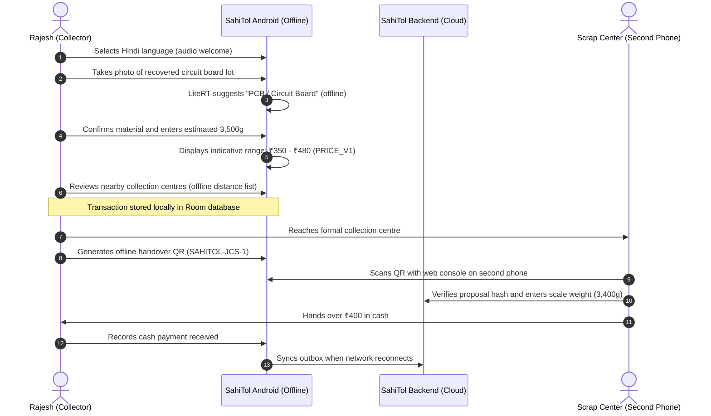
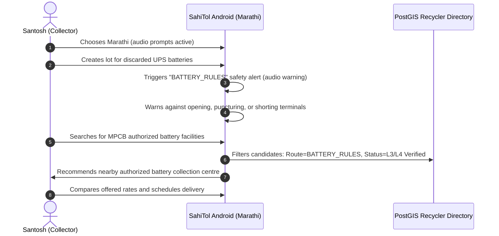
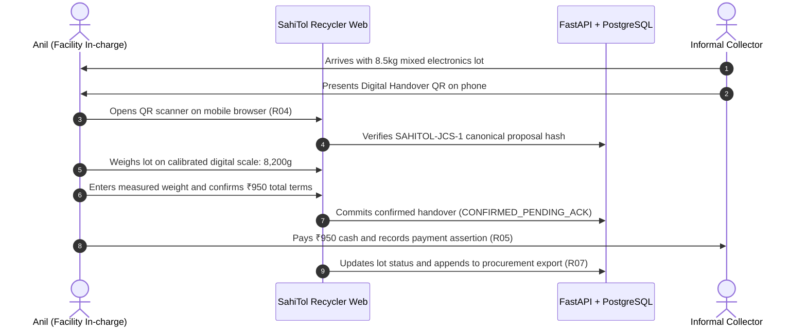

# Simulated Personas and Journey Maps

> [!IMPORTANT]
> **Provenance Disclosure**: These personas are synthesized exclusively from published desk research, academic studies, and the SIH26229 problem statement. **No primary interviews or fieldwork were conducted by this project.** Names, demographics, and scenarios are illustrative simulations to guide user experience and software testing; they do not depict real participating individuals.

---

## Persona A: Rajesh Kumar — Independent Collector (Delhi-NCR)

### Profile & Operating Context
- **Role**: Independent itinerant waste collector (*feriwallah* / *kabadiwala*)
- **Location**: Operates across East Delhi and Ghaziabad informal trading corridors
- **Language**: Hindi (Devanagari; functional conversational literacy, limited technical English)
- **Hardware**: Entry-level Android smartphone (Android 11, 2GB RAM, cracked screen, intermittent prepaid 4G data)
- **Primary Materials**: Household scrap, discarded small electronics (chargers, broken mobile phones, CRT TVs, fan motors, power supply units)
- **Financial Reality**: Operates on daily cash liquidity (needs ₹500–₹1,500 daily for household expenses). Cannot wait for weekly bank settlements. Relies on informal scrap dealers for quick turnarounds.

### Key Pain Points
1. **Uncertain Valuation**: Does not know whether a recovered computer motherboard or TV chassis is worth ₹20/kg or ₹150/kg; scrap dealers often quote mixed plastic rates.
2. **Connectivity Blackouts**: Loses internet connection when collecting inside dense residential lanes or metal-roofed godowns.
3. **Complex Formal Interfaces**: Intimidated by apps demanding PAN, GST, or bank account numbers.

### User Journey with SahiTol

---

## Persona B: Santosh Shinde — Electronics Repair & Scrap Collector (Pune)

### Profile & Operating Context
- **Role**: Commercial repair aggregator and collector
- **Location**: Industrial periphery of Pune and Pimpri-Chinchwad, Maharashtra
- **Language**: Marathi (fluent Marathi speaker and reader; prefers Marathi voice guidance)
- **Hardware**: Mid-tier Android smartphone (Android 13, 4GB RAM)
- **Primary Materials**: Commercial air conditioner scrap, industrial battery banks, discarded laptop components, power tools
- **Regulatory Awareness**: Knows that batteries are dangerous and subject to scrutiny, but lacks clarity on which nearby recyclers hold valid MPCB authorizations.

### Key Pain Points
1. **Hazardous Regulatory Risk**: Fear of being penalized for transporting scrap lithium-ion and lead-acid batteries together with general scrap.
2. **Linguistic Jargon**: English technical terms (e.g., "Cathode Ray Tube", "Printed Circuit Board") do not match regional Marathi trade vernacular (*e-kachra*, *shisha*, *tamba*).
3. **Stale Dealer Directories**: Has visited facilities listed on old government PDF lists only to find them shut down or refusing small lots.

### User Journey with SahiTol

---

## Persona C: Anil Verma — Formal Collection Centre / Dismantler Manager (Noida)

### Profile & Operating Context
- **Role**: Operations Manager at an authorized E-Waste Dismantling & Collection Centre
- **Location**: Industrial Area Phase II, Noida / Delhi-NCR border
- **Surface**: Desktop / Tablet browser (Recycler Web Console) and borrowed Android smartphone for warehouse gate scans
- **Regulatory Status**: Holds valid state pollution control board authorization for e-waste dismantling (capacity: 500 MT/year)
- **Primary Need**: Transparent procurement logs, tamper-evident transaction records to demonstrate traceability, and fast verification at the weighbridge.

### Key Pain Points
1. **Quality and Weight Mismatch**: Discrepancies between informal sellers' verbal claims and actual weighed moisture/contamination at the weighbridge.
2. **Double-Selling & Fraud**: Concerns about fraudulent sellers presenting the same lot photos or receipts to multiple buyers.
3. **Paperwork Burden**: Managing manual paper registers for dozens of small cash purchases every week.

### User Journey with SahiTol

